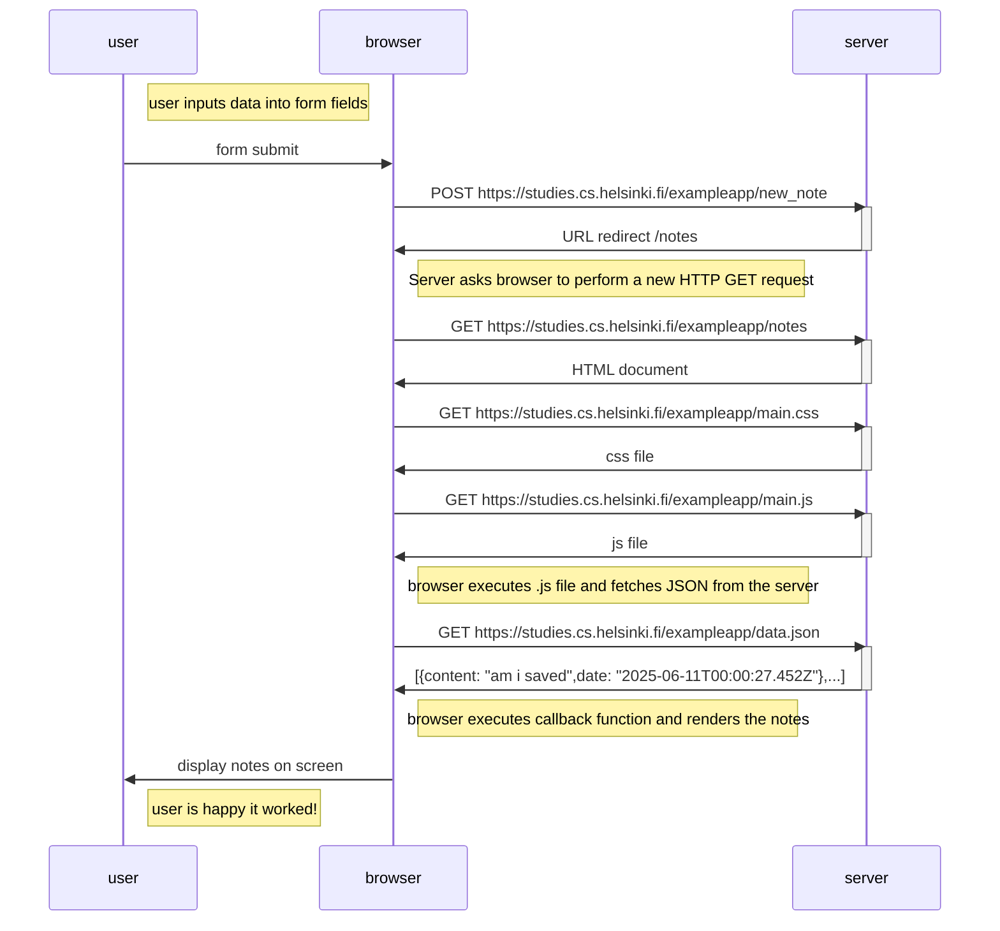

```mermaid
  sequenceDiagram
    participant user
    participant browser
    participant server

    note right of user: user inputs data into form fields
    user->>browser: form submit

    browser->>server: POST https://studies.cs.helsinki.fi/exampleapp/new_note
    activate server
    server->>browser: URL redirect /notes
    deactivate server

    note right of browser: Server asks browser to perform a new HTTP GET request

    browser->>server: GET https://studies.cs.helsinki.fi/exampleapp/notes
    activate server
    server->>browser: HTML document
    deactivate server

    browser->>server: GET https://studies.cs.helsinki.fi/exampleapp/main.css
    activate server
    server->>browser: css file
    deactivate server

    browser->>server: GET https://studies.cs.helsinki.fi/exampleapp/main.js
    activate server
    server->>browser: js file
    deactivate server

    note right of browser: browser executes .js file and fetches JSON from the server

    browser->>server: GET https://studies.cs.helsinki.fi/exampleapp/data.json
    activate server
    server->>browser: [{content: "am i saved",date: "2025-06-11T00:00:27.452Z"},...]
    deactivate server

    note right of browser: browser executes callback function and renders the notes
    browser->>user: display notes on screen

    note right of user: user is happy it worked!
```
