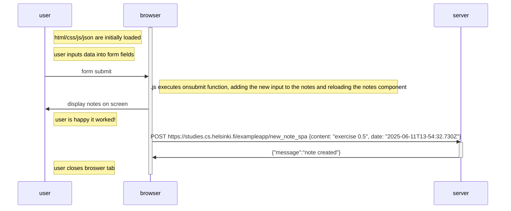

```mermaid
  sequenceDiagram
    participant user
    participant browser
    participant server

    activate browser
    note right of user: html/css/js/json are initially loaded
    note right of user: user inputs data into form fields
    user->>browser: form submit

    note right of browser: .js executes onsubmit function, adding the new input to the notes and reloading the notes component
    browser->>user: display notes on screen
    note right of user: user is happy it worked!

    browser->>server: POST https://studies.cs.helsinki.fi/exampleapp/new_note_spa {content: "exercise 0.5", date: "2025-06-11T13-54:32.730Z"}
    activate server
    server->>browser: {"message":"note created"}
    deactivate server

    note right of user: user closes broswer tab
    deactivate browser
```
